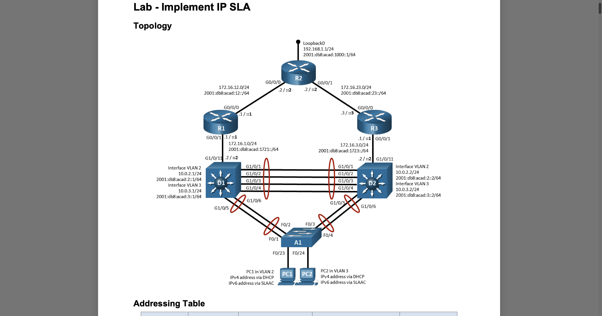
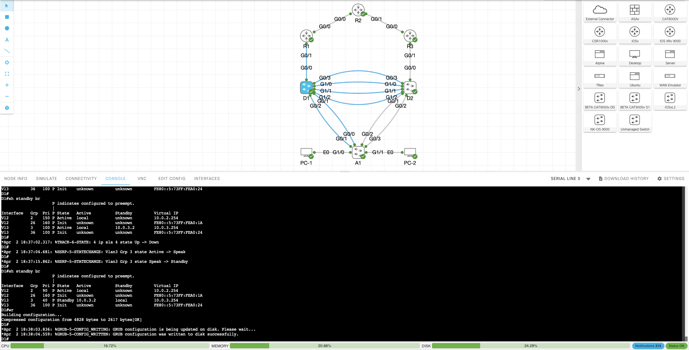

# 🔹 Cisco Lab: Implement IP SLA (ENCOR)

This lab demonstrates the implementation of **IP SLA**, **HSRP tracking**, and **enterprise-level troubleshooting** in a multi-layer Cisco network.

---

## 🖼️ Topology

### 🔸 Lab Diagram


### 🔸 Live Configuration / Lab Environment


---

## 📌 Overview

In this lab, I built and tested a multi-device Cisco topology consisting of:

- Core routers (R1, R2, R3)
- Distribution switches (D1, D2)
- Access switch (A1)
- End devices (PC1, PC2)

The main goal was to implement **IP SLA** to monitor network reachability and integrate it with **HSRP** for dynamic failover.

---

## 🔧 Technologies Used

- Cisco IOS
- IP SLA (ICMP Echo)
- HSRP (Hot Standby Router Protocol)
- VLANs & Inter-VLAN Routing
- EtherChannel (LACP)
- Trunking (802.1Q)
- DHCP & DHCP Relay
- IPv4 & IPv6

---

## 🧠 Lab Objective

The objective of this lab was to:

- Configure **IP SLA** to monitor remote network reachability  
- Use SLA tracking to influence **HSRP failover behavior**  
- Ensure **high availability** for end users  
- Troubleshoot DHCP and L3 connectivity issues  

---

## 🧩 What I Configured

---

### 🔹 1. VLAN & Layer 3 Interfaces

Configured SVIs on distribution switches:

```bash
interface vlan 2
 ip address 10.0.2.1 255.255.255.0

interface vlan 3
 ip address 10.0.3.1 255.255.255.0
